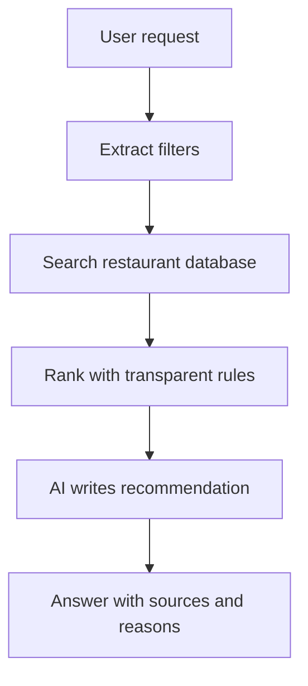

# Stockholm Independent Food Map

An interactive Vite/React concept for discovering Stockholm restaurants, bakeries, cafes and specialty coffee without allowing raw platform popularity to control the result.

## Local development

```bash
npm install
npm run dev
```

## What works now

- Standard Vite/React app, independent of the old Sites/vinext wrapper
- Category and text filtering across restaurants, bakeries, cafes and specialty coffee
- Separate quality, popularity, relevance, discovery and freshness dimensions
- Bayesian rating, recency weighting and exposure-adjusted engagement helpers
- Structured specialty-coffee attributes rather than keyword-only labels
- Drizzle schema for establishments, evidence sources, ratings, engagement, specialty attributes and score snapshots
- Cloudflare Pages Function at `/api/places`, with D1 when `DB` is bound and demo fallback only when explicitly enabled
- Explainable demo concierge
- Explicit confidence and evidence labels
- OpenStreetMap/Overpass Python collector
- Lauren Leek-inspired residual discovery model

The visible dataset is still illustrative. The important change is that the UI scores are now computed from auditable inputs instead of hard-coded final numbers.

## Checks

```bash
npm run typecheck
npm test
npm run build
npm run validate:artifact
```

## Cloudflare deployment

Cloudflare is kept as the deployment target without making local development depend on Cloudflare or Sites:

```bash
npm run deploy:cloudflare
```

That command builds the Vite app and deploys `dist/` with Wrangler Pages. Connect the Cloudflare project/account before running it.

For the GitHub-connected Cloudflare Pages project:

- Build command: `npm run build`
- Output directory: `dist`
- Node version: `22.13.0` or newer
- D1 binding name: `DB`
- Deployment type: Cloudflare Pages static site, not Wrangler/Workers deploy

If the deployment log says `No build command specified. Skipping build step.`,
set the Pages build command in the Cloudflare dashboard to `npm run build`.
The repo also includes `wrangler.toml` with `pages_build_output_dir = "dist"`
so Pages knows where the built assets belong.

Production APIs do not silently serve demo data. If D1/static OSM data is unavailable,
`/api/places`, `/api/concierge`, `/api/photos`, and `/api/reviews` return an
unavailable response rather than mixing illustrative fixtures into live results.
For local demos only, set
`ALLOW_DEMO_FALLBACK=true` for Cloudflare Functions and
`VITE_MOTKARTA_DEMO_MODE=true` for the Vite client.

After creating and binding D1, run the migration and optional demo seed if you
are managing the database from the CLI:

```bash
npm run db:generate
npm run db:seed:demo
wrangler d1 migrations apply <database-name> --remote
wrangler d1 execute <database-name> --remote --file drizzle/seed-demo.sql
```

## Python data pipeline

The project scope is now split deliberately:

- Python owns data collection, normalization, scoring experiments, ML discovery
  models and RAG document preparation.
- TypeScript/React owns the deployed UI and Cloudflare Pages integration.

### ML and recommendation documentation

The canonical agent and maintainer guide is [`docs/ml/README.md`](docs/ml/README.md).
It distinguishes every scoring subsystem and covers:

- [Architecture and ownership](docs/ml/architecture.md)
- [Data, label, event and privacy contracts](docs/ml/data-contracts.md)
- [Training, leakage controls and evaluation](docs/ml/training-and-evaluation.md)
- [Operations, versioning, rollback and troubleshooting](docs/ml/operations-runbook.md)
- [Maintenance policy and the prioritized next steps](docs/ml/maintenance-and-change-policy.md)
- [Mandatory agent SOP](directives/ml_recommendation_system.md)

Read those documents before changing anything described as discovery, scoring,
recommendation, hidden-gem detection, anomaly detection or personalization.

Install `requirements-python.txt`, then run:

```bash
python scripts/fetch_osm.py
```

This writes `data/stockholm_food_places.csv`. By default it queries the
OpenStreetMap administrative area named `Stockholms kommun`, caches the raw
Overpass response in `data/raw/osm_stockholm_food_places.json`, and writes source
metadata to `data/raw/osm_stockholm_food_places.metadata.json`. Later runs reuse
the cache unless you explicitly refresh:

```bash
python scripts/fetch_osm.py --refresh
```

A rough bounding-box fallback remains available for troubleshooting:

```bash
python scripts/fetch_osm.py --boundary bbox --refresh
```

Convert the CSV into D1 import SQL with:

```bash
npm run db:seed:osm
```

The generated file is `drizzle/seed-osm.sql`. It upserts OSM places by
`osm_type` + `osm_id`, stores OSM as source evidence, and normalizes categories
into the four establishment types:

- `restaurant`, `fast_food`, `food_court` -> `Restaurant`
- `bistro` remains cuisine/style metadata under `Restaurant`
- `bakery`, `pastry`, `confectionery` -> `Bakery`
- `cafe` -> `Café`
- `coffee`, `coffee_roaster` -> `Specialty coffee`

An ordinary OSM café is not promoted to specialty coffee just because its cuisine
mentions coffee; specialty coffee needs a structured OSM coffee shop/roaster
category or later editorial/source verification.

## Manual evidence enrichment

OSM is a baseline, not proof of quality. Add curated or licensed evidence with a
JSON file using the shape in `examples/evidence.sample.json`, then generate SQL:

```bash
npm run db:seed:evidence -- examples/evidence.sample.json drizzle/seed-evidence.sql
wrangler d1 execute <database-name> --remote --file drizzle/seed-evidence.sql
```

Evidence records match an existing place by `osmType` + `osmId`, or by exact
name as a fallback. Each evidence item must declare:

- `sourceType`: `specialist_guide`, `editorial`, `verified_user_rating`,
  `inspection`, `official_site`, `community_submission`, or `osm`
- `sourceName`
- `confidence` from `0` to `1`
- optional `url`, `capturedAt`, and `summary`

Specialty-coffee attributes can be updated in the same record, but should only
be set from recognized guides, editorial review, your own verification, or
consistent community submissions.

## Additional source ingestion

The next source layer starts with municipal food-control records, serving-permit
imports and curated guide evidence.

### OpenStreetMap and Overpass Turbo

Production ingestion uses `scripts/fetch_osm.py`, which talks directly to the
Overpass API and records the query hash/source metadata. Overpass Turbo is useful
as a human workbench for testing changes to the same Overpass QL query, but it
should not be a runtime dependency for the app.

### Google metadata quarantine

Google Places is optional and quarantined. Use it only to find possible new
places, fill missing street/address fields, capture official website URLs, and
fetch imagery from the venue's own website metadata:

```bash
python3 scripts/google_places_monthly_sync.py --dry-run
python3 scripts/google_places_monthly_sync.py
```

The sync writes Google-only discoveries to
`outputs/google_places_candidates.json` for manual review instead of publishing
them directly into ranked results. It must not request or store Google ratings,
reviews, review counts, price level, prominence, ranking, editorial summaries, or
engagement/value signals.

Build a unified lifecycle queue after OSM, municipal, Google-metadata, and
curated-source imports:

```bash
npm run candidates:build -- --validation-labels examples/human_validation_labels.sample.json
npm run candidates:seed -- outputs/candidate_queue.json drizzle/seed-candidates.sql
wrangler d1 execute <database-name> --remote --file drizzle/seed-candidates.sql
```

The queue writes `outputs/candidate_queue.json` with four explicit states:
`baseline`, `candidate`, `verified`, and `featured`. Candidate records are
review inputs only; they are not high-confidence recommendations until a human or
source-gate workflow promotes them.

The candidate seed generator imports candidate/verified/featured queue entries by
default. It upserts neutral place metadata into D1, stores source identity in
`candidate_source_type` and `candidate_source_id`, creates source evidence rows,
and refuses forbidden value fields such as Google ratings, review counts,
popularity, price level, prominence, or scores. Existing `verified` and
`featured` lifecycle states are preserved on re-import.

### Admin review and promotion

The admin UI lives at the real path `/admin`, not a public hash route. Protect
both `/admin*` and `/api/admin/*` with Cloudflare Access so the review,
harvest-status, schema-check, and label-export controls are hidden from public
visitors before the React app or admin APIs run.

Recommended production auth uses Cloudflare Access JWT verification:

```bash
wrangler pages secret put MOTKARTA_ACCESS_TEAM_DOMAIN
wrangler pages secret put MOTKARTA_ACCESS_AUD
wrangler pages secret put MOTKARTA_ADMIN_EMAILS
```

`MOTKARTA_ACCESS_TEAM_DOMAIN` is the Access team domain, for example
`https://your-team.cloudflareaccess.com`. `MOTKARTA_ACCESS_AUD` is the Access
application audience tag for the protected admin app. `MOTKARTA_ADMIN_EMAILS` is
an optional comma-separated allowlist of admin account emails.

`MOTKARTA_ADMIN_TOKEN` is still supported as a local/dev fallback, but it is no
longer the normal production workflow. If Access is active, the browser calls
`/api/admin/session`, the API verifies the Cloudflare Access session, and the UI
unlocks without asking for a token.

When `/admin` opens, the UI automatically calls `/api/admin/schema`, checks the
bound `DB`, and prepares the known admin review tables/columns. No Wrangler
database name is needed for the admin workflow. It then reads the session
dashboard from `/api/admin/review-dashboard`, then candidates from
`/api/admin/candidates`. The dashboard shows whether the next operational step is
review, harvest, export, or caught up. The queue shows source identity,
address/website metadata, evidence counts and source gaps, then promotes records
by updating only `lifecycle_state`, `validation_label`, `validation_notes`, and
`updated_at` on `establishments`. Hidden-gem promotion requires at least two
independent non-Google evidence signals.

The same review panel flags likely duplicates by exact normalized name+area,
exact normalized address, or near coordinates with similar names. `Merge` copies
candidate evidence/tags onto the selected canonical record, marks the candidate
as `duplicate_resolution = 'merged'`, and keeps the candidate row as audit
history. `Keep separate` records `duplicate_resolution = 'keep_separate'`
without promoting the candidate.

Each promotion or duplicate decision writes an `admin_review_events` audit row.
If neither Cloudflare Access verification nor the local token fallback is
configured, the admin API remains closed. If D1 is missing, it returns an
unavailable response and never falls back to demo rows.

When a review session is done, open `/admin` and press **Export** in the label
export row. The browser downloads a portable `human_validation_labels` JSON file
directly from the D1 audit events. The UI export also writes an
`admin_label_exports` checkpoint, which lets the dashboard show whether any
review decisions are newer than the latest export.

The same export can still be produced from the command line when needed:

```bash
wrangler d1 execute <database-name> --remote --json --file scripts/export_review_events.sql > data/review-events-export.json
npm run reviews:labels -- data/review-events-export.json outputs/human_validation_labels.json
```

The label export keeps duplicate resolutions separate from hidden-gem/mainstream
labels so they do not contaminate ML training labels.

Fetch and normalize Stockholm food-control establishments:

```bash
npm run food-control:fetch -- --refresh
npm run food-control:match
```

The default fetch uses recent inspections (`TillsynsDatum >= '2024-01-01'`) and
caps the ArcGIS paging so local runs stay quick. Use
`scripts/fetch_food_control.py --help` to widen the date range or page limit for
a fuller historical refresh.

This writes:

```text
data/stockholm_food_control.csv
data/stockholm_food_control_matches.csv
outputs/food_control_evidence.json
```

Generate a database-ready seed from the matched evidence with:

```bash
node scripts/generate_evidence_seed_sql.mjs outputs/food_control_evidence.json drizzle/seed-food-control.sql
```

The food-control source is used as inspection/registration evidence only. It is
not a restaurant-quality signal by itself, and it can include schools, stores,
caterers and institutional kitchens. The matcher only attaches evidence to
existing OSM food places when name/address/coordinate evidence is strong enough.

Serving permits are supported as a curated CSV import because a clean public
establishment-level register has not been verified yet:

```bash
npm run permits:match -- --permits data/serving_permits.csv
```

Use `examples/serving_permits.sample.csv` as the column template. Matched rows
produce `outputs/serving_permit_evidence.json` with `sourceType:
serving_permit`.

Independent local guides should be entered as curated evidence records, not
scraped/copied reviews. Store source URL, source name, confidence, tags and our
own short summary. Use:

```bash
npm run guides:seed
```

`examples/independent_guides.sample.json` shows the expected format.

Curated open sources may also add or enrich public places when the record is
neutral and source-attributed. The approved production source set currently
includes Anders Husa & Kaitlin Orr Guide, White Guide Nordic, Specialty Coffee
Sweden Registry, Visit Stockholm, Stockholm City food-control data, and
OpenStreetMap. These sources must not import ratings, review counts, price
levels, popularity, ranking, copied review text, or synthetic engagement.

```bash
python3 scripts/sync_curated_sources.py
```

`data/curated_open_places.json` is the neutral curated source file. The MVP
pipeline also runs this sync after regenerating the OSM baseline so curated
open-source additions are not erased by a refresh.

## Score snapshots

Scores can be recomputed into `score_snapshots` after importing OSM and evidence.
Export current D1 rows, combine them, generate score SQL, then apply it:

```bash
wrangler d1 execute <database-name> --remote --json --file scripts/export_places.sql > data/place-export.json
wrangler d1 execute <database-name> --remote --json --file scripts/export_evidence.sql > data/evidence-export.json
wrangler d1 execute <database-name> --remote --json --file scripts/export_tags.sql > data/tag-export.json
npm run db:scores:combine -- data/place-export.json data/evidence-export.json data/tag-export.json data/score-input.json
npm run db:scores -- data/score-input.json drizzle/score-snapshots.sql
wrangler d1 execute <database-name> --remote --file drizzle/score-snapshots.sql
```

This preserves raw evidence separately from computed score snapshots, so score
changes can be audited and rerun as the model improves.

For the residual model, enrich/merge source data into a CSV containing:

`name`, `platform_rating`, `review_count`, `price_level`, `latitude`, `longitude`, `category`, `cuisine`, `district`, `chain_status`.

Then run:

```bash
python scripts/model_discovery.py enriched_stockholm_places.csv
```

The output includes an out-of-fold expected platform rating, residual confidence
bounds, empirical `underexposure_confidence`, validation fold and model version.
Spatially grouped cross-validation prevents a venue from being scored by a model
that trained on that venue. A positive residual is interpreted as *algorithmic
surprise*, not intrinsic food quality. See [`docs/discovery-model-card.md`](docs/discovery-model-card.md).
The ML output is always marked as a `candidate` proposal and includes source-gap
flags; evidence gates decide whether anything can become a high-confidence hidden
gem.

Run Python tests with:

```bash
python3 -m pytest tests_python
```

The Python package lives in `motkarta/`:

- `motkarta.normalize`: OSM/category normalization
- `motkarta.scoring`: score formulas for ML/data workflows
- `motkarta.rag`: retrieval document preparation

## Python MVP pipeline

The agreed MVP covers restaurants, bakeries, cafés and specialty coffee, with
bistros treated as restaurant cuisine/style metadata rather than a top-level
category. The Python pipeline produces the core artifacts:

```bash
python scripts/fetch_osm.py
.venv/bin/python scripts/run_mvp_pipeline.py
```

Outputs:

```text
data/stockholm_food_places_clean.csv
data/stockholm_food_places_deduped.csv
data/stockholm_food_duplicates.csv
data/stockholm_food_excluded_chains.csv
data/stockholm_food_places_scored.csv
outputs/stockholm_food_map.html
outputs/stockholm_food_places.geojson
outputs/coverage_report.md
outputs/rag_corpus.jsonl
public/data/places.json
```

## AI Concierge Architecture with RAG

The AI Concierge retrieves verified establishments from the database before passing context to the language model to synthesize an answer:



1. **User request**: The user submits a natural discovery query (e.g. *"specialty coffee and a cardamom bun in Södermalm"*).
2. **Extract filters**: Parses intent for establishment type, tags, location, and independence criteria.
3. **Search restaurant database**: RAG retrieval searches candidate documents from `outputs/rag_corpus.jsonl` (Python) or Cloudflare D1/places (`/api/concierge`).
4. **Rank with transparent rules**: Ranks candidate places using explicit quality, recency, and discovery rules rather than platform review counts.
5. **AI writes recommendation**: Prompt engineering enforces strict grounding so the LLM synthesizes recommendations exclusively from retrieved database facts.
6. **Answer with sources and reasons**: Delivers explainable recommendations backed by discovery scores, evidence labels, and source citations.

### Ethical & Technical Charter

1. **Meaning of "Unbiased"**: "Unbiased" means **transparent, plural-source, and auditable**—not perfectly objective. All ranking inputs and formulas are published and reproducible.
2. **No Negative Inference**: The system **never infers that a business is bad** simply because it lacks online reviews or has missing metadata attributes.
3. **No Copyrighted Content**: Does not republish copyrighted blog text, paywalled articles, or commercial review copy.
4. **Source Attribution & Open Licensing**: Preserves OpenStreetMap ODbL and Stockholm Stad CC0 source attribution and license headers across all exports and API responses.
5. **Separation of Facts & Scoring**: Strictly separates verifiable physical facts (address, coordinates, opening hours) from algorithmic discovery scores.
6. **Explicit Confidence & Uncertainty**: Displays confidence levels (`High`, `Medium`, `Low`) for uncertain attributes and explicitly flags missing data (e.g. unverified opening hours or price tiers).
7. **Auditable Correction History**: Maintains a change log history rather than silently overwriting records, and supports owner/community corrections via OpenStreetMap.
8. **Terms Compliance**: Uses open public APIs and datasets (OpenStreetMap Overpass API, Stockholm Stad Portal); **does not scrape Google Maps** in violation of terms.
9. **Google Metadata Quarantine**: If Google Places is used at all, it is restricted to neutral metadata only: possible new-place discovery, missing street/address fields, official website URL, and official-site imagery. Google ratings, reviews, review counts, price level, prominence, editorial summaries, ranking, and engagement/value signals must never enter Motkarta scoring or evidence confidence. New Google-only discoveries go to a manual candidate queue, not directly into ranked results.

### Establishment Scope

The project explicitly covers four establishment types:
- **Restaurants**
- **Bakeries and patisseries** (`Bakery`)
- **General cafés** (`Café`)
- **Specialty-coffee cafés and roasters** (`Specialty coffee`)

### Multi-Dimensional Scoring Framework

Rather than producing a single opaque "best" score, the system computes and presents four distinct dimensions separately:

| Dimension | Meaning | Implementation Focus |
| :--- | :--- | :--- |
| **Quality** | Evidence that the establishment is good | Specialist guides, independent editorial, inspection status, verified attributes, specialty proof |
| **Popularity** | Evidence that many people choose or return | Bayesian user rating, exposure-adjusted engagement, repeat visit rate, recent saves |
| **Relevance** | How well it matches the current user | Explicit intent, kind, cuisine, price level, purpose, and preference tags |
| **Discovery Value** | Strong quality signals with limited exposure | Quality paired with lower mainstream exposure (prevents winner-take-all bias) |

Hidden-gem labeling is gated, not just score-based. A place can only receive the
high-confidence hidden-gem treatment when all of these pass:

- `mainstreamExposure <= 40`
- at least 2 independent evidence signals
- current existence evidence from recent source freshness or municipal/field data
- a distinctiveness reason beyond simply being obscure
- lifecycle state is visible (`baseline`, `verified`, or `featured`; not `candidate`)

### Quality Score Signals & Specialty Attributes

Quality cannot be measured reliably from average star ratings alone. The system builds the Quality dimension from 9 independent evidence signals:

1. **Specialist Guide Inclusion** (`specialist_guide`): Inclusion in manually curated guides (e.g. White Guide).
2. **Independent Editorial** (`independent_editorial`): Recommendations from multiple independent editorial sources.
3. **Verified User Ratings** (`verified_user_rating`): Bayesian-adjusted user rating baseline.
4. **Repeat Visits** (`repeat_visits`): High proportion of returning patrons.
5. **Recent Reviews** (`recent_reviews`): Weighting recency over legacy lifetime volume.
6. **Credible Reviewers** (`credible_reviewers`): Reviews from users with a verified historical record.
7. **Inspection Status** (`inspection_status`): Municipal hygiene control status as a safety baseline (not a taste rating).
8. **Verified Attributes** (`verified_attributes`): Verified physical and operational attributes.
9. **Data Freshness & Confidence** (`data_freshness`, `confidence`): Source recency and evidence confidence rating.

For **Specialty Coffee** cafés and roasters, the system stores structured attributes rather than marketing labels:

```json
{
  "specialty_verified": true,
  "own_roastery": false,
  "traceable_coffee": true,
  "filter_coffee": true,
  "espresso_based": true,
  "rotating_roasters": true,
  "single_origin": true,
  "manual_brew_methods": ["V60", "Aeropress"],
  "decaf_available": true,
  "beans_for_sale": true
}
```

### Exposure-Adjusted Engagement Rate & Tracked Signals

To prevent position bias (where frequently shown places accumulate more clicks and become artificially more popular), engagement is measured relative to exposure:

$$\text{engagement rate} = \frac{\text{saves} + \text{confirmed\_visits} + \text{direction\_requests}}{\text{search\_impressions}}$$

The system tracks 8 granular engagement signals:
1. `search_impressions` (Search-result impressions)
2. `profile_views` (Profile views)
3. `map_marker_clicks` (Map-marker clicks)
4. `saves` (Saves)
5. `direction_requests` (Direction requests)
6. `confirmed_visits` (Confirmed visits)
7. `repeat_visits` (Repeat visits)
8. `recommendations` (Recommendations to others)

Using Bayesian rate smoothing ($\text{prior\_rate} = 0.08, \text{prior\_weight} = 50$), conversion efficiency is fairly compared:
- **Small Café**: 200 impressions, 50 saves $\rightarrow$ **21.6% Bayesian engagement rate**
- **Famous Café**: 20,000 impressions, 800 saves $\rightarrow$ **4.01% Bayesian engagement rate**

This ensures small, highly loved establishments rank above heavily exposed, low-conversion places.

### Measuring Significance (Recommendation & Statistical A/B Study)

The project distinguishes two forms of significance:

#### 1. Recommendation Significance (Confidence Score)

Determines whether there is sufficient evidence to single out an establishment:
- Number of independent sources (`sources_count`)
- Number of recent observations (`recent_observations`)
- Agreement between sources (`source_consensus`)
- Owner-supplied vs. independently verified status (`independently_verified`)
- Sample size and last verification date (`last_verified_date`)

```text
Quality: 86/100
Popularity: 54/100
Discovery value: 91/100
Confidence: High—verified by three independent sources.
```

#### 2. Statistical Significance & A/B User Study

Evaluates whether transparent multi-signal ranking genuinely improves discovery compared to raw popularity:

- **Ranking A**: Raw popularity (review count / rating volume)
- **Ranking B**: Transparent multi-signal ranking (Quality, Relevance, Popularity, Discovery)

```bash
PYTHONPATH=. .venv/bin/python scripts/evaluate_ranking_experiment.py
```

**Tracked Study Metrics**:
- **Unfamiliar Discovery Ratio**: % of recommendations with discovery score $\ge 50$ (Ranking A: 60.0% $\rightarrow$ **Ranking B: 100.0%**)
- **Cuisine Diversity (Shannon Entropy)**: Measure of culinary variety (Ranking A: 2.75 $\rightarrow$ **Ranking B: 4.02**)
- **Geographic Diversity**: Outer-city vs. central district representation
- **Independent Business Ratio**: Percentage of non-chain establishments
- **Independent Outcome Rate**: only calculated when the input contains an
  observed or human-labelled outcome such as `would_return`, `positive_outcome`,
  or `human_relevance_label`

Without an independent outcome column the script reports representation metrics,
but deliberately returns `hypothesis_confirmed: null`. A discovery score is never
used as a proxy for satisfaction with a ranking produced from that same score.

Event-level learning data is stored in `recommendation_events`. Record an
`impression` for every displayed venue, including those receiving no later action,
along with result position and model version. This is required to distinguish
non-selection from non-exposure and to train a later debiased ranker.

The pipeline excludes obvious large fast-food chains from the scored/map/public
artifacts by default. Current explicit exclusions are McDonald's, Burger King,
Sibylla and MAX. Removed rows are still written to
`data/stockholm_food_excluded_chains.csv` for auditability.
Other known chains can remain visible, but they do not receive the
`independent_business` discovery bonus.

The discovery score is a transparent 100-point additive model:

```text
independent_business      +25
underrepresented_cuisine  +20
low_local_visibility      +20
verified_open             +15
complete_profile          +10
recently_updated          +10
```

Each scored row includes the boolean signal columns plus `discovery_reasons`.
`recently_updated` uses per-place OSM timestamps when available; cached rows
without timestamps do not receive those 10 points.

The Folium map includes filter layers for establishment type, cuisine,
neighbourhood and missing information. The GeoJSON export is the migration path
for a later Leaflet, MapLibre, Mapbox or CARTO app. `public/data/places.json`
is the deployable static dataset used by the Vite app before falling back to
the Cloudflare API/demo path. The RAG corpus powers a simple local concierge:

```bash
.venv/bin/python scripts/query_concierge.py "filter coffee roaster"
```

The shorthand refresh flow is:

```bash
npm run mvp:fetch
npm run mvp
npm run build
```

`npm run mvp` appends source metadata to `outputs/coverage_report.md` when the
fetch metadata file is present.

## Research lineage

The residual approach is inspired by Lauren Leek's Open Food Map and London research. This Stockholm version changes the scope in two important ways: it starts with an open OSM baseline rather than treating a commercial API as a census, and it explicitly includes bakeries, cafés, roasters and specialty-coffee attributes.

## Production next steps

1. Replace the rough bounding box with the Stockholm municipality polygon.
2. Negotiate/verify licences for specialist guide and editorial data.
3. Add municipal food establishment and serving-permit registers.
4. Build source-aware entity matching and manual review.
5. Collect consent-aware impression and outcome events, then validate ranking
   weights with temporal holdouts and user testing instead of asserting objective quality.
