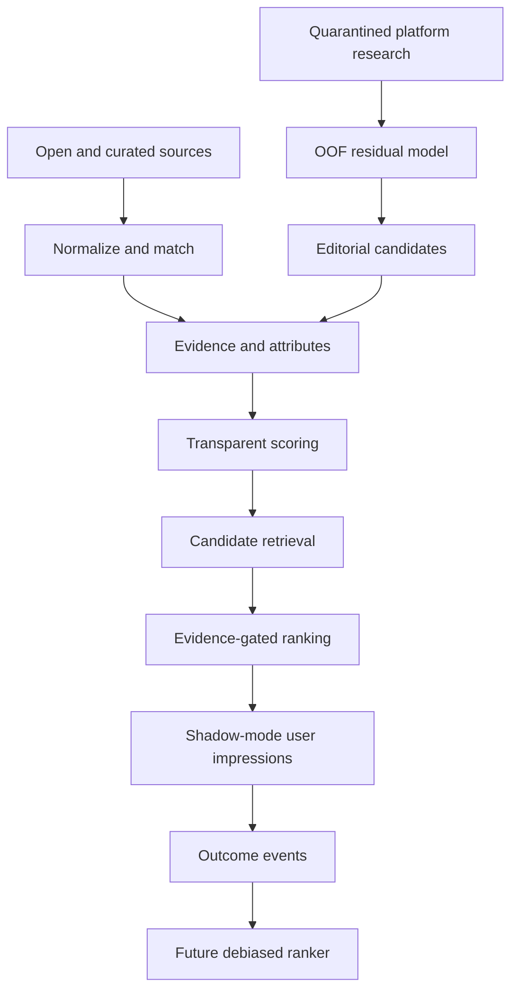

# Motkarta ML system

This directory is the canonical documentation for machine learning, ranking,
recommendation telemetry, evaluation and model maintenance in Motkarta.

Read this page before changing anything described as scoring, discovery,
recommendation, hidden-gem detection, anomaly detection, personalization or AI
Concierge retrieval.

## Mission

Motkarta exists to help people discover independent food and drink venues
without reproducing the visibility feedback loops of commercial platforms.
Machine learning is used to reveal patterns, improve relevance and nominate
candidates for review. It is not permitted to manufacture certainty, bypass
evidence gates or silently optimize for engagement.

“Unbiased” means transparent, plural-source, auditable and actively monitored
for exposure concentration. It does not mean perfectly objective.

## Documentation map

| Document | Purpose |
| --- | --- |
| [Architecture](architecture.md) | Systems, boundaries, ownership and data flow |
| [Data contracts](data-contracts.md) | Required fields, output fields, events, labels, privacy and versioning |
| [Training and evaluation](training-and-evaluation.md) | Training procedure, leakage prevention, uncertainty and metrics |
| [Operations runbook](operations-runbook.md) | Commands, artifacts, deployment prerequisites, rollback and troubleshooting |
| [Maintenance policy](maintenance-and-change-policy.md) | Change control, reviews, compatibility, drift and agent handoff |
| [Underexposure model card](../discovery-model-card.md) | Formal intended-use and limitation statement for the current ML model |
| [ML directive](../../directives/ml_recommendation_system.md) | Mandatory SOP for agents carrying out ML work |

## Current implementation status

As of 2026-08-25:

| Capability | Status | Production authority |
| --- | --- | --- |
| Transparent multi-signal scoring | Implemented | `lib/scoring.ts` |
| Python scoring counterpart | Implemented for data workflows | `motkarta/scoring.py` |
| OSM additive discovery score | Implemented for pipeline exports | `motkarta/pipeline.py` |
| Residual underexposure model | Implemented as offline candidate research | `scripts/model_discovery.py` |
| Structural anomaly detection | Implemented as review assistance only | `motkarta/outliers.py` |
| Hidden-gem evidence gates | Implemented | `lib/scoring.ts` and admin lifecycle |
| Event-level recommendation schema | Implemented | `recommendation_events` in `db/schema.ts` |
| Event collection endpoint/UI instrumentation | Implemented in shadow mode | `functions/api/recommendation-events.ts`, `src/App.tsx` |
| Personalized learning-to-rank model | Not implemented | Requires real impression/outcome data |
| Online experiment assignment | Not implemented | Requires event collection and privacy review |
| Automated drift monitoring | Not implemented | Required before automatic retraining |

## The five non-negotiable boundaries

1. **Platform data quarantine.** Commercial ratings, review counts, prominence,
   price ranking and commercial engagement may be used only in isolated audit
   research. They must not enter Motkarta quality or evidence-confidence scores.
2. **A residual is not quality.** A positive residual means a platform rating is
   higher than the model expected under observed structural conditions. It does
   not prove that the venue is good.
3. **An anomaly is not a hidden gem.** Isolation Forest detects unusual data
   records. It cannot award hidden-gem status.
4. **No self-evaluation.** A ranking must never use its own score as the proxy
   for satisfaction. Outcome claims require independent labels or observations.
5. **No learning without exposure data.** A missing click is not a negative
   preference unless the venue was actually shown. Record impressions and result
   positions before training a behavioral recommender.

## System overview

The quarantined platform-research path may nominate a candidate. It never joins
the public ranking path directly.

## Current event collection foundation

The application collects recommendation events in shadow mode only. Events are
validated through controlled vocabularies, carry zero-based result positions for
impressions, include `transparent-scorer-v1` as the deterministic scorer version,
and store idempotency, receipt, expiry, schema-version and privacy-version
metadata. Query context is minimized to structured buckets; raw free-text search
queries are not accepted by the ingestion contract.

Shadow-mode event data is not authorized for personalized ranking. It must first
pass data-quality reporting, retention/privacy review and attribution analysis.

## Terminology

| Term | Exact meaning |
| --- | --- |
| Quality score | Weighted, source-aware evidence score; not universal truth |
| Popularity score | Bayesian and exposure-adjusted Motkarta engagement score |
| Relevance score | Fit between venue attributes and stated user preferences |
| Discovery score | Context-dependent name; identify the owning subsystem before using it |
| Recommendation score | Transparent weighted combination used by the application scorer |
| Rating residual | Platform rating minus out-of-fold expected platform rating |
| Underexposure confidence | Monotonic research confidence derived from residual/error radius; not probability |
| Structural anomaly | Unusual OSM/data-completeness feature pattern |
| Candidate | A venue proposed for review; not automatically user-visible or recommended |
| Verified | Venue has passed the relevant evidence and lifecycle review |
| Featured | Verified venue intentionally highlighted by editorial/product policy |
| Impression | A venue was rendered in a recommendation result set |
| Outcome | An independent behavior or label such as save, visit or would-return |

## Before beginning ML work

An agent must:

1. Read the [ML directive](../../directives/ml_recommendation_system.md).
2. Identify which scoring/model subsystem owns the requested behavior.
3. Inspect the current schema and tests rather than relying on this document alone.
4. State whether the change affects research candidates, production ranking,
   public labels, data collection or evaluation.
5. Preserve the five boundaries above.
6. Create a new immutable model version if predictions can change.
7. Add or update tests and documentation in the same change.

## Definition of done

ML-related work is not complete until:

- Data lineage and allowed use are documented.
- Leakage and exposure risks have been reviewed.
- Offline metrics include representation slices, not only an aggregate score.
- User-facing claims remain evidence-gated and explainable.
- Model/version identifiers are stored with outputs and events.
- Python tests, JavaScript tests, typecheck and relevant build checks pass.
- This documentation and the ML directive still describe the implementation.
