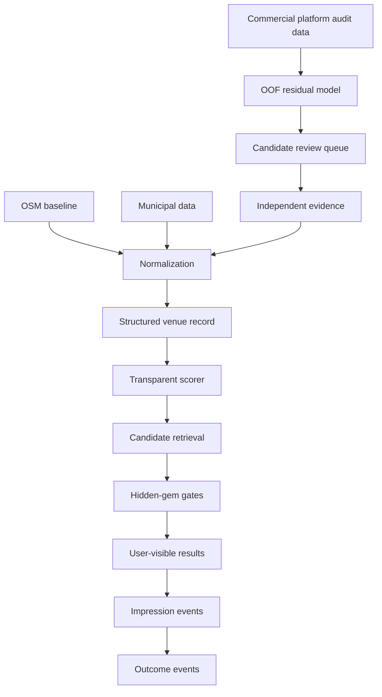

# ML and ranking architecture

Concierge catalog update (2026-09-06): the
[reconciliation record](concierge-reconciliation.md) describes the applied data
repairs and local identity bridge. D1 remains the server authority; public IDs
remain stable for map/saved/media state. Explicit OSM identities and existing
duplicate mappings connect the namespaces without database entity merges.

## Purpose

This document separates Motkarta's scoring and ML subsystems. Several modules
produce fields named `discovery`, `score` or `hidden_gem`; they have different
data sources and permissions and must not be treated as interchangeable.

## Component inventory

### 1. OSM pipeline discovery score

- Owner: `motkarta/pipeline.py`
- Function: `discovery_score(row)`
- Type: deterministic additive heuristic
- Inputs: independent-business flag, underrepresented cuisine, low local
  visibility, opening-hours availability, profile completeness and OSM recency
- Output: `discovery_score` from 0 to 100 plus `discovery_reasons`
- Used by: generated CSV, GeoJSON, map and RAG corpus
- Permitted claim: transparent open-data discovery signal
- Prohibited claim: learned quality prediction

Current weights:

| Signal | Points |
| --- | ---: |
| Independent business | 25 |
| Underrepresented cuisine | 20 |
| Low local visibility | 20 |
| Verified/listed opening hours | 15 |
| Complete profile | 10 |
| Recently updated OSM record | 10 |

This score rewards discoverability characteristics and data completeness. It can
still contain OSM contributor-activity bias and must not be presented as food quality.

### 2. Production TypeScript scorer

- Owner: `lib/scoring.ts`
- Entry point: `scorePlace(place, preferences)`
- Type: deterministic, explainable multi-signal scoring
- Output dimensions: quality, popularity, relevance, discovery, freshness and
  recommendation, plus verification and hidden-gem gate breakdowns
- Used by: the Vite/Cloudflare application
- Current scorer version: `transparent-scorer-v1.1`

Recommendation formula:

```text
0.35 × relevance
+ 0.25 × quality
+ 0.15 × popularity
+ 0.15 × discovery
+ 0.10 × freshness
```

This is the production authority for application scoring. A weight change is a
ranking-policy change and follows the maintenance policy.

`transparent-scorer-v1.1` keeps the formula and gates from v1, but normalizes
partial evidence and engagement records at the scoring boundary. Missing numeric
subfields are treated as absent evidence rather than allowed to produce `NaN`
scores.

The app-level ranking controls live in `src/app/place-ranking.ts`. They avoid
personalization claims: `All recommendations` means the deterministic Motkarta
recommendation score, not a user/account-specific feed. The first dropdown
narrows already-scored venues by recommendation mode before sorting:
hidden-gem eligible venues, the top popularity slice, specialist-selected venues
or high-confidence verified venues. The second dropdown only sorts that current
result set, so it should not change the result count. `Motkarta score` is the
transparent scorer order. Deterministic
tie-breakers keep broad evidence buckets from leaving the rendered list
unchanged. The app shell clears the active map card when these controls change
so an old selection is not presented as the new result. Controls without backing
public data are hidden until their data source exists. These controls do not
change stored score outputs or authorize a learned ranker.

### 3. Python scoring counterpart

- Owner: `motkarta/scoring.py`
- Entry point: `score_place(place, preferences)`
- Type: deterministic multi-signal scoring for Python/data workflows
- Purpose: offline scoring, experiments and parity-oriented testing

The Python and TypeScript implementations are similar but not guaranteed to be
byte-for-byte identical. Do not assume parity. Any change intended for both
runtime paths must update both implementations and add parity fixtures or clearly
document why the behaviors intentionally differ.

### 4. Residual underexposure model

- Owner: `scripts/model_discovery.py`
- Model version: `discovery-hgbr-spatial-oof-v1`
- Estimator: `HistGradientBoostingRegressor`
- Type: supervised offline research model
- Target: quarantined `platform_rating`
- Output: expected rating, residual, empirical interval, confidence, fold and version
- Allowed use: nominate `candidate` records for evidence review
- Forbidden use: direct public rank, quality score or automatic hidden-gem label

Every published prediction is out-of-fold. Approximate spatial cells are grouped
in validation so the scored venue and its cell do not train its prediction model.

### 5. Structural anomaly detector

- Owner: `motkarta/outliers.py`
- Entry point: `process_motkarta_gems(frame)`
- Estimator: `IsolationForest`
- Inputs: local density, tag complexity, opening-hours detail and estimated OSM longevity
- Canonical outputs: `structural_anomaly_score`, `is_structural_anomaly`,
  `structural_interest_index`
- Allowed use: data-quality checks and editorial investigation
- Forbidden use: quality evidence or hidden-gem promotion

Compatibility columns `anomaly_score` and `gem_index` currently remain in some
exports. `is_hidden_gem` is forced false by this detector. Remove compatibility
columns only through an explicit data-contract migration.

### 6. Hidden-gem gates

- Owner: `evaluateHiddenGemGates()` in `lib/scoring.ts`
- Purpose: prevent a high score, obscurity or ML output from becoming a public claim

All gates must pass:

1. Mainstream exposure is at or below the configured threshold.
2. At least two independent evidence signals exist.
3. Current existence is supported by recent, municipal or field evidence.
4. A specific distinctiveness reason exists beyond obscurity.
5. Lifecycle state is user-visible and not marked closed/wrong-category.

Final application behavior is defensive:

```text
is_hidden_gem = input flag AND all hidden-gem gates pass
```

### 7. Concierge retrieval and synthesis

- Owners: `motkarta/concierge.py`, `motkarta/rag.py`, `scripts/api_endpoint.py`,
  `lib/concierge-parser.ts`
- Purpose: retrieve grounded venue records and synthesize a natural-language response

The language model is not a ranker of record. Candidate selection and structured
filters happen before synthesis. Generated answers must remain grounded in the
retrieved database context and must not invent prices, opening hours or attributes.

The fallback API prefers keyword relevance and transparent discovery score.
Structural anomaly is never quality evidence.

### 8. Recommendation telemetry

- Owner: `recommendation_events` in `db/schema.ts`
- Migration: `drizzle/0007_pale_mikhail_rasputin.sql`
- Controls migration: `drizzle/0009_breezy_tomas.sql`
- Ingestion/reporting: `functions/api/recommendation-events.ts`
- Frontend instrumentation helpers: `src/ml/recommendationInstrumentation.ts`
- Frontend wiring: `src/App.tsx`
- Admin model-status surface: `src/admin/AdminMlDashboard.tsx`
- Purpose: shadow-mode event-level exposure and outcome data for future debiased ranking

The schema, ingestion endpoint and frontend instrumentation exist, but collection
is shadow-mode only. No agent may claim a behavioral ranker is ready until event
quality, attribution, retention and privacy behavior are validated over a real
collection interval.

The frontend instrumentation module is a separation boundary, not a new ranking
authority. It owns browser/session identifiers, result-set identities and
controlled query-context conversion for rendered OpenStreetMap/Overpass-derived
results. Future hidden-gem training or expert RAG Concierge work should add
feature extraction, attribution datasets or model-status surfaces beside this
module, while preserving the event contract and deterministic hidden-gem gates.

Current contract decisions:

- Impression `result_position` is zero-based.
- `model_version` is `transparent-scorer-v1.1` for deterministic app ranking.
- Idempotency is enforced through `idempotency_key`; impression keys include a
  per-result-set identity plus a complete context hash.
- `expires_at`, `schema_version` and `privacy_version` are stored with new rows.
- Query context is minimized to controlled structured buckets; raw free text,
  arbitrary display labels and unrestricted strings under allowlisted keys are
  rejected.

## Data flow and trust boundaries



Trust increases only through evidence and review. ML cannot move a record directly
from quarantined platform data to user-visible status.

## Source-of-truth hierarchy

When documentation and code disagree:

1. Database migration and current schema determine stored structure.
2. Runtime code determines actual behavior.
3. Tests describe expected behavior.
4. This documentation describes intent and operating policy.

The mismatch itself is a bug. Fix code/tests or documentation in the same pull
request; do not silently choose whichever version supports the desired outcome.

## Architectural invariants

- Facts, evidence, computed scores and model predictions remain separate fields/tables.
- Score snapshots are reproducible and timestamped.
- Candidate state is not equivalent to verified or featured state.
- Commercial platform audit data never crosses into intrinsic quality scoring.
- Every behavioral training row must be traceable to an impression.
- Every model output and recommendation event carries a model version.
- User-facing explanations come from named signals, not opaque feature importance alone.
- Deterministic gates remain outside the learned model.

## Known architectural debt

- TypeScript and Python multi-signal scorers can drift.
- The OSM additive score and application discovery dimension share a name.
- Legacy `gem_index`/`anomaly_score` fields remain for compatibility.
- Event schema exists without collection infrastructure.
- No automated feature registry or model artifact registry exists.
- No production ranker calibration or drift dashboard exists.

Address these through explicit migrations, not opportunistic renaming.

## Concierge architecture update (2026-09-05)

The Pages production owner is `functions/api/concierge.ts`, with pure modules in
`lib/concierge/`. The server trusts D1, merges lexical/vector candidates behind
flags, rechecks current evidence and lifecycle, and validates constrained fact-ID
synthesis. The browser sends query/context and renders cards by ID. Python is
an offline adapter. This supersedes section 7’s incomplete owner inventory.
See [Concierge RAG](concierge-rag.md) for the implemented boundaries and deliberate
Python/TypeScript differences. The global scorer formula/version is unchanged.
